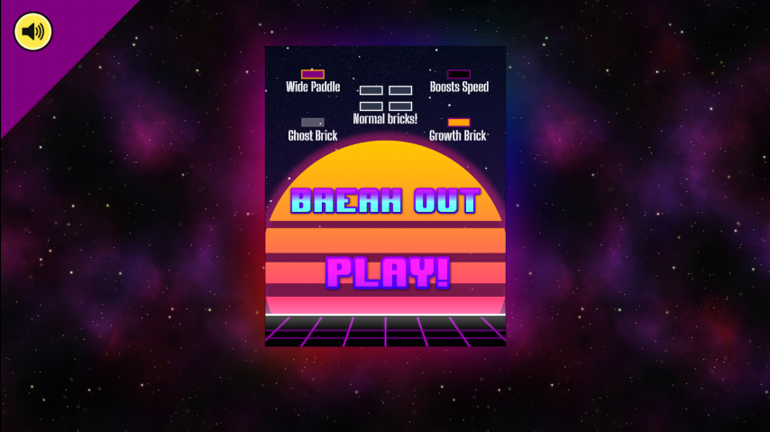

# JS-BreakOut

Live Link: https://gilleece.github.io/JS-BreakOut/

 A break out clone built using Javascript, HTML5 and CSS. 

## Features 
- HTML Canvas based game, created using pure Javascript.
- 5 levels, each level introduces a new block and increases game speed.
- 5 unique blocks with individual behaviours.
- Sound effects and background music.
- Mute button that utilizes local storage to recall the player's choice.
